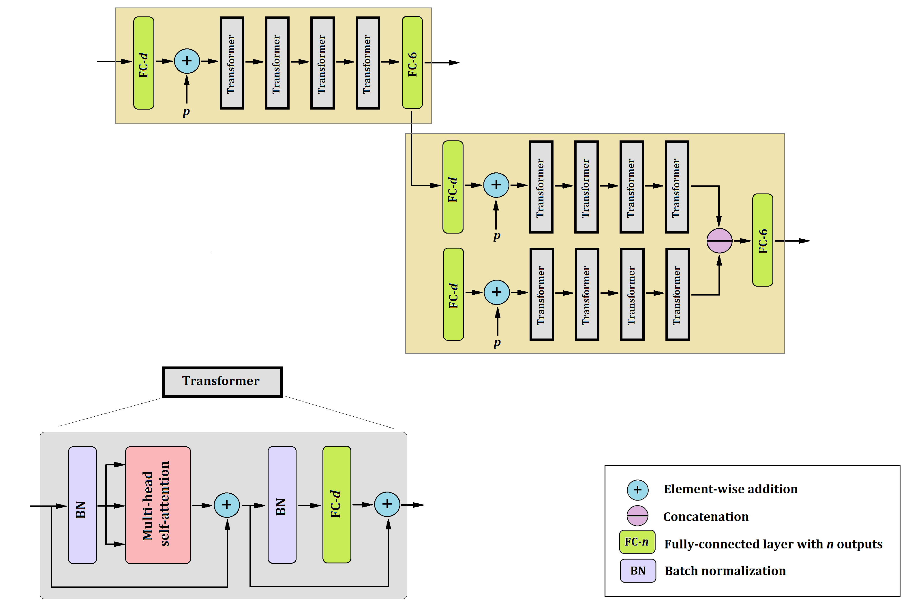

# Transformer-DTI

# Highly accurate and robust diffusion tensor estimation with only 6 measurements.

This is a deep neural networks model for diffusion tensor estimation.

The model is based on the Trnasformer neural networks.

The work was completed at IMAGINE laboratory of Boston Children's Hospital, Harvard Medical School  (https://imagine.med.harvard.edu/).

For questions and comments please email davood.karimi@childrens.harvard.edu.

## Model architecture

  

## Trained model

A trained docker model can used by running the following lines.

docker pull davoodk/transformer_dti
docker run   --mount src=/DATA_DIR/,target=/src/results/,type=bind  transformer_dti:1.0

DATA_DIR refers to your local data directory. For the code to run successfully, you need to place the folloiwng files in DATA_DIR:

### Diffusion-weighted MR image.

This should be a nifti image and the filename shuld end in "dwi.nii.gz".

### Brian mask

This should also  be a nifti image and should include "brainmask" in the filename.

### b-values and b-vectors files

These should be test files and include "bval" and "bvec" in the filenames. They should be readable by numpy's loadtxt command.

The above formats have been chosen following the developing Human Connectome Project naming. You could use this dataset to test the code.

After the code is finished running, a "results" directory under DATA_DIR will include the results. The results will include diffusion tensor image and several tensor-derived parameters (such as fractional anisotropy and mean diffusivity), as well as a whol-brain connectome. Thes files will be estimated with CWLLS using all diffusion  measurements, and with the propsoed Transformer-DTI using 6 measurements.

## Results:

On dHCP data, as well as other datasets, our method with only 6 measurements can estimate the diffusion tensor with an accuracy that matches the accuracy of standard DTI reconstruction methods with 88 measurements.

### Tensor and tensor-derived parameters

  

### Tractography

  

